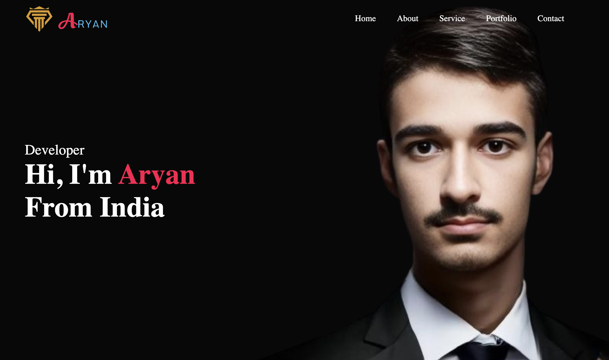
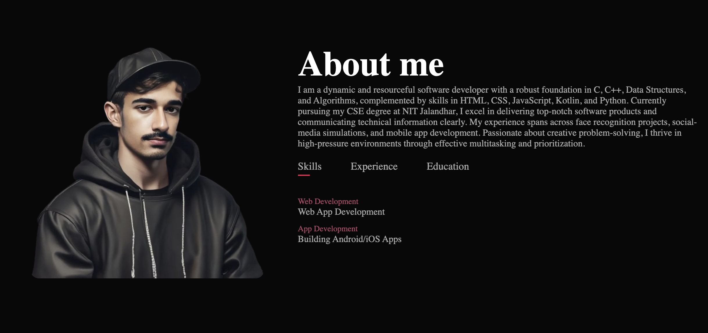
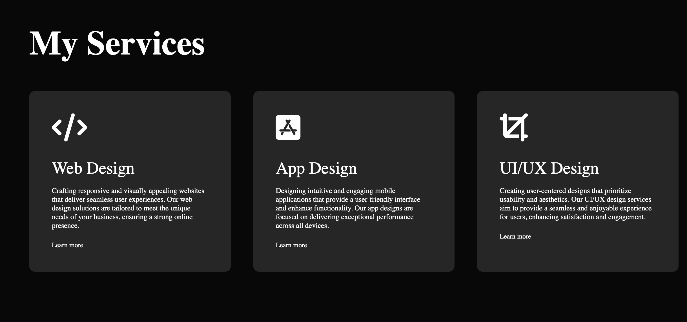
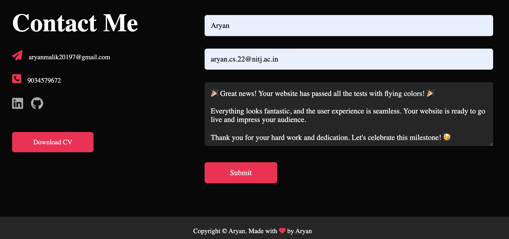
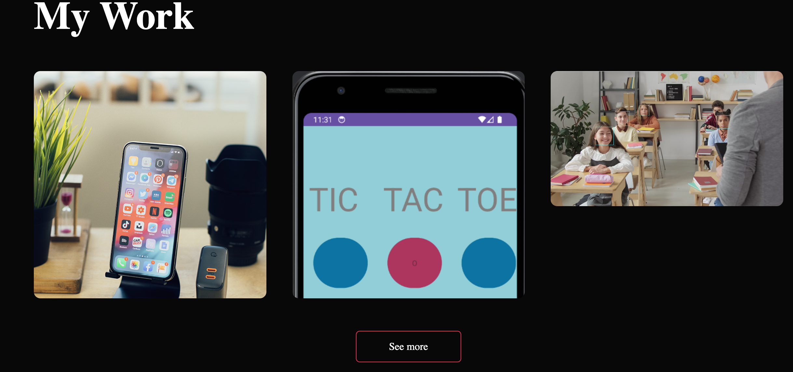

# Aryan's Portfolio Website 🌐

Welcome to my portfolio website repository! This project showcases my skills, projects, and experience in web development, app design, and UI/UX design. Dive in to learn more about me and my work.

## 🚀 Project Overview

This website is designed to provide a comprehensive overview of my professional journey. It includes sections like Home, About, Services, Portfolio, and Contact, each tailored to highlight different aspects of my expertise and experience.

## 📂 Sections

### Home
The landing page introduces who I am and my role as a developer.

### About

A detailed view of my background, skills, experience, and education.

### Services

An overview of the services I offer, including web design, app design, and UI/UX design.

### Contact

Get in touch with me via the contact form, email, or social media links.

### Work

Get in touch with me via the contact form, email, or social media links.

## 🛠️ Technologies Used

- HTML5
- CSS3
- JavaScript
- Font Awesome

## 📧 Contact

Feel free to reach out if you have any questions or opportunities!

- Email: [aryanmalik20197@gmail.com](mailto:aryanmalik20197@gmail.com)
- LinkedIn: [Aryan's LinkedIn](https://www.linkedin.com/in/aryan-1b8059276)
- GitHub: [ARYAN-ark-1](https://github.com/ARYAN-ark-1)

## 📄 License

This project is licensed under the MIT License. See the [LICENSE](LICENSE) file for more details.

---

Thank you for visiting my portfolio website repository! 😊
